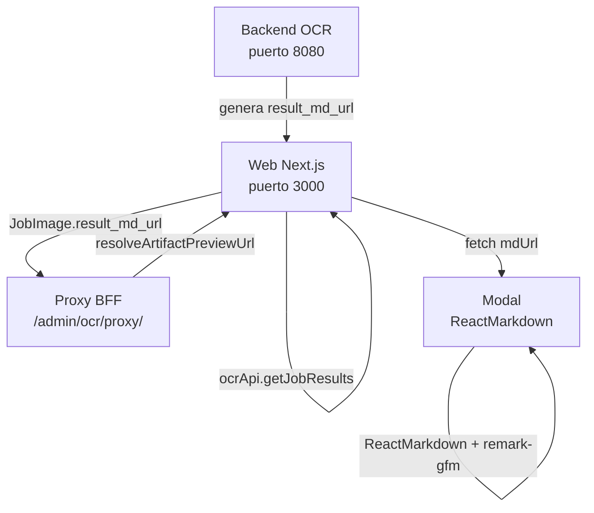

# 📄 Modal de Reporte Técnico OCR/LLM

> Documentación del visor modal para leer en pantalla los reportes `.md` generados por el pipeline OCR, sin salir del **Visor Operativo de Job OCR**.

---

## 🎯 Objetivo

En la ruta `/accounts/colgate_ecuador/jobs/{job_id}`, cada imagen del job trae un reporte técnico en `result_md_url`. 

**Hoy:** Se puede abrir/descargar el archivo, pero **no verlo formateado** dentro de la web.

**El modal resuelve eso:**

| Funcionalidad | Detalle |
|---|---|
| 📖 Lee markdown remoto | Vía proxy BFF |
| 🎨 Renderiza bien | Títulos, listas, tablas, bloques `text` y `json` |
| 💾 Permite descargar | Guarda el `.md` local |
| 🔗 Abre en pestaña | Visiona markdown raw en nueva pestaña |
| 🔄 No reemplaza | Coexiste con el link de descarga existente |

---

## 📋 Ejemplo de Contenido del `.md`

Archivo típico por imagen (ej. job `2026-06-10_14-56-11`):

```markdown
# OCR Debug Report - {nombre_imagen}.png

## Resumen
- total_products: 1
- processing_status: completed

## Pipeline Fase 1 A 7
- Fase 1: Detección visual principal | stage=detection | status=ok
  - evidencia:
    - {"primary_area_filter": {...}}

## OCR Crudo Completo
### PRIMARY | crop=crop_xxx.jpg
```text
CORAL INTERMERCADOS
PRODUCTO JABON DE TOCADOR
...
```

## Interpretacion Visual / LLM
  - visual_structured_products_before_rules:
    ```json
    [{ "producto": "DOVE JABON DE TOCADOR", "field_audit": {...} }]
    ```

## Productos Finales
- 1. DOVE JABON DE TOCADOR 3X90G | precio=3.37
```

### 🔍 Secciones Clave que el Modal debe Mostrar Bien

| Sección | Formato | Ejemplo |
|---------|---------|---------|
| 📊 **Resumen** | Listas `-` | `total_products: 1` |
| 🔄 **Pipeline Fase 1–7** | Listas anidadas + JSON inline | Detección, extracción, análisis |
| ⚙️ **Configuración y reglas** | Listas largas de aliases | Mapeos de productos |
| 📝 **OCR crudo** | Bloques ` ```text ` | Texto extraído de imagen |
| 🤖 **LLM / productos** | Bloques ` ```json ` | Structured data |
| ✅ **Productos finales** | Listas + `field_audit` JSON | Resultados procesados |

---

## 🔄 Flujo de Datos



**Flujo detallado:**

1. **Backend OCR** (`:8080`) genera `result_md_url` por imagen
2. **Web** (`npm run dev`) obtiene URL vía `ocrApi.getJobResults(jobId)`
3. **Proxy BFF** resuelve la URL a `/admin/ocr/proxy/static/...`
4. **Modal** hace `fetch(mdUrl)` y obtiene texto plano
5. **ReactMarkdown** + `remark-gfm` renderiza HTML formateado

> ⚠️ **Importante:** Si el backend OCR en `localhost:8080` no está levantado, el proxy devuelve `500 fetch failed` y el modal no carga contenido.

---

## 🛠️ Archivos a Crear / Modificar

### 1️⃣ Nuevo Componente

**Archivo:** `src/components/jobs-history/markdown-report-viewer.tsx`

**Exporta:**

- `MarkdownReportViewer` — renderiza markdown con tema oscuro
- `MdReportModal` — diálogo fullscreen con scroll
- `fetchMarkdownReport(url)` — helper opcional

**Dependencias requeridas:**

```bash
npm install react-markdown remark-gfm
```

---

### 2️⃣ Página del Visor de Jobs

**Archivo:** `src/components/jobs-history/account-job-detail-page.tsx`

**4 cambios necesarios:**

#### A. Estado del modal

```typescript
const [mdViewerModal, setMdViewerModal] = useState<MdReportModalState>(null);
```

#### B. Query para cargar el `.md`

```typescript
const mdModalQuery = useQuery({
  queryKey: ["job-md-modal", mdViewerModal?.url],
  enabled: Boolean(mdViewerModal?.url),
  queryFn: async () => {
    const response = await fetch(mdViewerModal!.url, { cache: "no-store" });
    if (!response.ok) throw new Error(`No se pudo cargar markdown (${response.status})`);
    return response.text();
  },
});
```

#### C. Helper para abrir el modal

```typescript
function openMdViewer(title: string, rawUrl: string, downloadFilename?: string) {
  const url = resolveArtifactPreviewUrl(rawUrl) ?? rawUrl;
  setMdViewerModal({ title, url, downloadFilename });
}
```

#### D. Render del modal (al final del JSX)

```tsx
<MdReportModal
  state={mdViewerModal}
  content={mdModalQuery.data ?? null}
  isLoading={mdModalQuery.isLoading}
  error={mdModalQuery.error instanceof Error ? mdModalQuery.error.message : null}
  onClose={() => setMdViewerModal(null)}
/>
```

---

## 🎯 Dónde Poner los Botones

### 📌 Pestaña **Artefactos** (PRIORIDAD 1)

En la fila de botones debajo del preview de imagen:

| Control | Acción | Estilo |
|---------|--------|--------|
| **Ver reporte técnico (.md)** | Abre modal | Botón primario |
| **Descargar .md** | Guarda archivo | Link secundario |

En la tabla de `result_md_url`:

| Control | Acción | Detalle |
|---------|--------|--------|
| Botón cyan **Ver (.md)** | Abre modal | con `event.stopPropagation()` |
| Link **Descargar .md** | Pestaña nueva | para no cambiar imagen seleccionada |

> ⚠️ Usar `event.stopPropagation()` en la celda para que no cambie la imagen seleccionada al hacer clic.

---

### 📌 Pestaña **Visual/OCR** (PRIORIDAD 2)

Card **Reporte técnico de análisis OCR/LLM**:

- ✅ Botón principal → Abre modal
- ✅ Vista inline con `MarkdownReportViewer` (sustituye `<pre>` plano)
- ✅ Link secundario → Abre en pestaña nueva

---

### 📌 Pestaña **Productos** (PRIORIDAD 3)

En **Detalle técnico** de cada producto:

- Resolver imagen por `image_process_code`
- Mostrar **Ver .md** si `result_md_url` existe
- Link a modal con título del producto

---

## 🎨 Diseño del Modal

### Estructura Visual

```
┌─────────────────────────────────────────────────────────────┐
│ 📄 Reporte OCR/LLM · {nombre_imagen}                        │
│    Reporte técnico OCR/LLM en Markdown                      │
│                    [Descargar .md] [Abrir en pestaña] [X]   │
├─────────────────────────────────────────────────────────────┤
│  # OCR Debug Report                                         │
│  ## Resumen                                                 │
│  - total_products: 1                                      ▲ │
│  ## Pipeline Fase 1 A 7                                   █ │
│  ┌ json block formateado ─────────────────────────────┐     █ │
│  │ { "producto": "DOVE ...", "field_audit": {...} }  │     ▼ │
│  └───────────────────────────────────────────────────┘       │
│  ...more content...                                         │
└─────────────────────────────────────────────────────────────┘
```

### Estilos Tailwind

| Elemento | Tailwind | Propósito |
|----------|----------|-----------|
| **Overlay** | `bg-black/80` | Oscurece fondo |
| **Fondo modal** | `bg-slate-950` | Tema oscuro |
| **Títulos h1** | `text-white` `text-2xl` | Contraste máximo |
| **Títulos h2** | `text-cyan-400` `text-xl` | Destaque de secciones |
| **JSON block** | `bg-emerald-950/30` `text-green-300` | Diferencia de código |
| **OCR block** | `bg-black/40` `text-gray-300` | Bloque de texto |
| **Scroll** | `max-h-[92vh] overflow-y-auto` | Altura máxima con scroll |

---

## 📦 Código de Referencia

La implementación vive en el **worktree**:

```
C:\Users\DISEÑO\.grok\worktrees\supermarket-ocr-web-web\ui\
├── src/components/jobs-history/markdown-report-viewer.tsx
└── src/components/jobs-history/account-job-detail-page.tsx
    (buscar "openMdViewer" para ver integración)
```

### 🔄 Pasos para Portar al Repo Activo

1. ✅ Copiar `markdown-report-viewer.tsx`
2. ✅ Aplicar cambios en `account-job-detail-page.tsx`
3. ✅ `npm install react-markdown remark-gfm`
4. ✅ Reiniciar `npm run dev`
5. ✅ Verificar backend OCR en `:8080`

---

## 🧪 Prueba Manual

### Preparación

```bash
# Terminal 1: Backend OCR
cd ~/supermarket-ocr-demo
uvicorn app.api.main:app --port 8080

# Terminal 2: Web
cd ~/supermarket-ocr-web/web
npm run dev
```

### Flujo de Test

1. Navega a → `/accounts/colgate_ecuador/jobs/2026-06-10_14-56-11`
2. Abre pestaña → **Artefactos**
3. Selecciona → imagen Dove
4. Haz clic en → **Ver reporte técnico (.md)** ✨
5. Verifica modal con secciones:
   - ✅ Resumen
   - ✅ Pipeline Fase 1–7
   - ✅ Bloques JSON formateados
   - ✅ Productos finales
6. Prueba **Descargar .md** → debe guardar archivo local
7. Prueba **Abrir en pestaña** → debe abrir markdown raw

---

## ⚠️ Errores Comunes

| Síntoma | Causa | Solución |
|---------|-------|----------|
| `500 fetch failed` en proxy | Backend OCR apagado | `uvicorn app.api.main:app --port 8080` |
| Modal vacío / error carga | `result_md_url` null | Verificar job tiene debug habilitado |
| Cambios no se ven | Editando otro worktree | Editar `C:\GitHub\supermarket-ocr-web\web` |
| JSON sin formato | Falta `remark-gfm` | `npm install react-markdown remark-gfm` |
| Lenguaje no detectado | Falta tag ` ```json ` | Verificar markdown tiene language tags |

---

## ✅ Checklist de Implementación

- [ ] **Dependencias:** `npm install react-markdown remark-gfm`
- [ ] **Componente:** Crear `markdown-report-viewer.tsx`
- [ ] **State:** Agregar `mdViewerModal` + `mdModalQuery` + `openMdViewer`
- [ ] **Artefactos:** Botón modal en preview + tabla
- [ ] **Visual/OCR:** Botón modal en card reporte técnico
- [ ] **Productos:** Botón modal por `image_process_code`
- [ ] **Render:** `<MdReportModal />` al final de JSX
- [ ] **Testing:** Probar con job `2026-06-10_14-56-11`
- [ ] **Backend:** Verificar OCR en `:8080`

---

> 🎉 **¡Listo para implementar!**